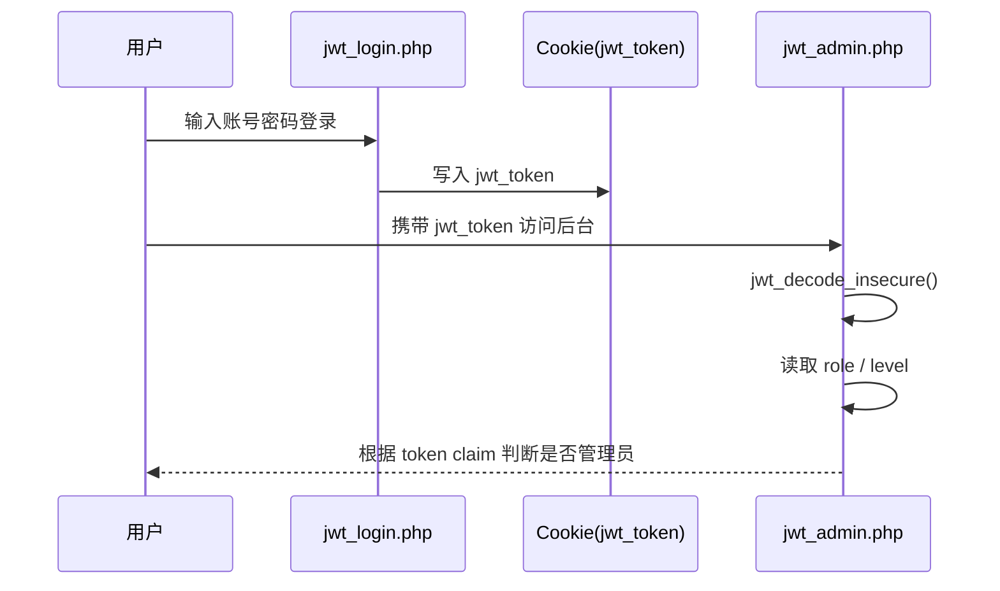
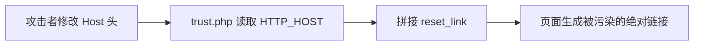
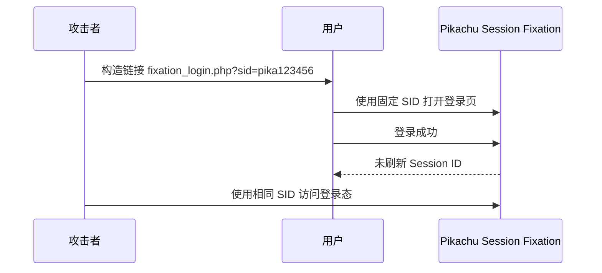
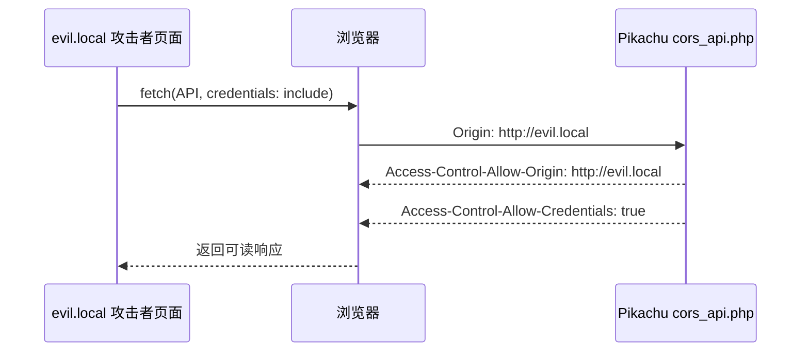
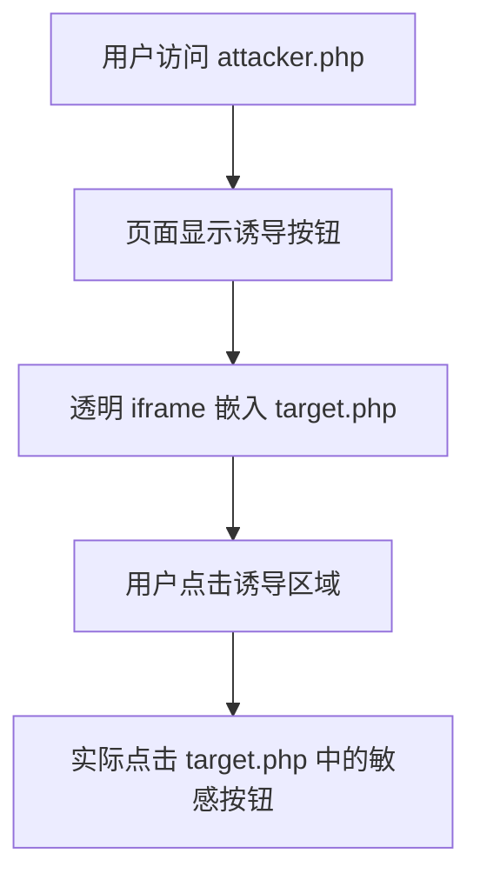
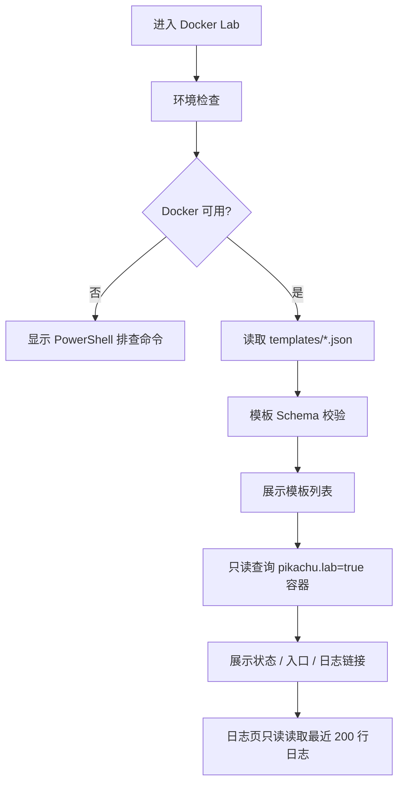
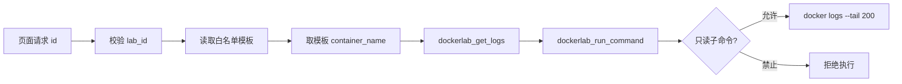
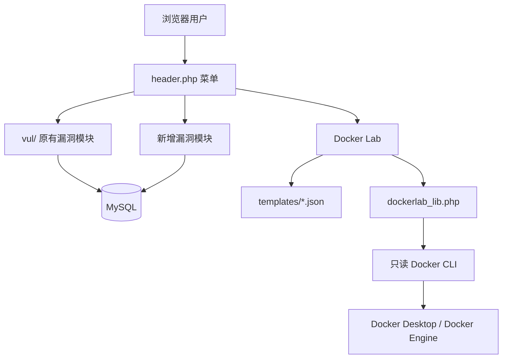

<p align="center">
  
  
  
  
  
</p>

<h1 align="center">⚡ Pikachu Enhanced</h1>

<p align="center">
  一个面向 Web 安全学习、漏洞复现、靶场扩展和本地 Docker 漏洞环境编排的增强版 Pikachu。
</p>

> “如果你想搞懂一个漏洞，比较好的方法是：先自己制造出这个漏洞，再利用它，最后再修复它。”

---

## 📌 项目简介

`Pikachu Enhanced` 是基于经典 Pikachu Web 漏洞练习平台进行增强改造的本地靶场项目。原版 Pikachu 主要以 `PHP + MySQL` 的单体 Web 页面形式演示常见 Web 漏洞，本增强版在保留原有漏洞模块和页面风格的基础上，新增了现代 Web 安全中更常见的认证、浏览器安全边界、会话安全、请求头信任以及 Docker 靶场编排能力。

本项目适合用于：

- 🧪 Web 漏洞学习与复现
- 🛡️ 渗透测试入门训练
- 🧩 漏洞原理教学与演示
- 🧰 本地靶场环境快速搭建
- 🐳 后续通过 Docker Lab 扩展 Redis、MySQL、Flask 等独立漏洞环境

---

## ⚠️ 安全声明

> 本项目包含大量**故意设计的漏洞**，请务必只在本地、授权、隔离环境中使用。

- ✅ 仅限本地学习、授权测试、安全研究和教学演示
- ❌ 不要部署到公网
- ❌ 不要在生产环境运行
- ❌ 不要将 Docker Lab 暴露到公网或不可信网络
- ✅ Docker / Docker Lab 相关端口默认应绑定到 `127.0.0.1`
- ✅ 使用前请确认你有合法授权
- ⚠️ 任何在非授权环境中的使用风险由使用者自行承担

---

## 🧭 目录

- [项目简介](#-项目简介)
- [安全声明](#️-安全声明)
- [和原版 Pikachu 的区别](#-和原版-pikachu-的区别)
- [功能总览](#-功能总览)
- [新增漏洞模块](#-新增漏洞模块)
- [Docker Lab / 靶场编排中心](#-docker-lab--靶场编排中心)
- [项目架构](#-项目架构)
- [部署方式一：传统 PHP 环境部署](#-部署方式一传统-php-环境部署)
- [部署方式二：Docker 运行 Pikachu](#-部署方式二docker-运行-pikachu)
- [使用说明](#-使用说明)
- [漏洞模块验证指南](#-漏洞模块验证指南)
- [Docker Lab 验证指南](#-docker-lab-验证指南)
- [目录结构说明](#-目录结构说明)
- [后续规划](#-后续规划)
- [GitHub 推送建议](#-github-推送建议)

---

## 🆚 和原版 Pikachu 的区别

| 对比项 | 原版 Pikachu | 本增强版 Pikachu Enhanced |
|---|---|---|
| 基础技术栈 | PHP + MySQL | PHP + MySQL，保持兼容 |
| 经典 Web 漏洞 | 已覆盖常见基础漏洞 | 保留原有基础模块 |
| JWT 安全 | 无独立模块 | 新增 JWT `alg=none` / claim 盲信演示 |
| Host Header | 无独立模块 | 新增 Host Header 信任问题演示 |
| Session Fixation | 无独立模块 | 新增会话固定演示 |
| CORS | 无独立模块 | 新增 Origin 反射与 Credentials 错配演示 |
| Clickjacking | 无独立模块 | 新增 iframe 点击劫持演示 |
| Docker Lab | 无 | 新增 Phase 1 只读靶场编排中心 |
| Docker 模板 | 无 | Redis / MySQL / Flask SSTI 白名单模板 |
| 安全边界 | 传统单体靶场 | 增加本地绑定、白名单模板、只读命令约束 |
| GitHub 文档 | 简洁说明 | 增强 README、流程图、部署与验证指南 |

---

## ✅ 功能总览

### 原有漏洞模块

- 🔐 Brute Force（暴力破解）
- 🧨 XSS（跨站脚本）
- 🔁 CSRF（跨站请求伪造）
- 🧬 SQL Injection（SQL 注入）
- 💻 RCE（远程命令 / 代码执行）
- 📂 File Inclusion（文件包含）
- 📥 Unsafe File Download（不安全文件下载）
- 📤 Unsafe File Upload（不安全文件上传）
- 🧱 Over Permission（越权）
- 🗂️ Directory Traversal（目录遍历）
- 🕵️ Information Leakage（敏感信息泄露）
- 🧪 PHP Unserialize（PHP 反序列化）
- 🧾 XXE（XML 外部实体）
- 🔀 URL Redirect（不安全 URL 重定向）
- 🌐 SSRF（服务端请求伪造）
- 🛠️ XSS 管理工具

### 新增漏洞模块

- 🪪 JWT(JSON Web Token)
- 🧭 Host Header Trust
- 🧷 Session Fixation
- 🌍 CORS Misconfiguration
- 🖱️ Clickjacking

### 新增平台能力

- 🐳 Docker Lab / 靶场编排中心 Phase 1
- 🔍 Docker 环境检查
- 📋 白名单模板加载
- 📦 模板容器状态只读查看
- 📜 白名单容器日志只读查看

---

## 🧩 新增漏洞模块

### 1. 🪪 JWT(JSON Web Token)

#### 模块路径

```text
vul/jwt/
├── jwt.php
├── jwt_login.php
└── jwt_admin.php
```

#### 漏洞原理

JWT 通常由三部分组成：

```text
header.payload.signature
```

本模块演示服务端错误信任 JWT Header 和 Payload 的情况，例如：

- 允许 `alg=none`
- 服务端不校验签名直接信任 payload
- 直接根据 token 中的 `role` / `level` 判断权限

#### 教学重点

- JWT 不是“加密”，而是“签名后的声明”
- `alg=none` 是典型错误实现
- 不能只信任客户端传回来的权限字段
- 服务端必须严格校验算法、签名、过期时间和权限来源

#### 演示流程



---

### 2. 🧭 Host Header Trust

#### 模块路径

```text
vul/hostheader/
├── hostheader.php
└── trust.php
```

#### 漏洞原理

很多系统会使用请求头中的 `Host` 拼接绝对链接，例如：

- 密码重置链接
- 邮箱激活链接
- 跳转地址
- 资源绝对 URL

如果服务端直接信任 `HTTP_HOST`，攻击者就可以通过篡改 Host 头污染链接。

#### 教学重点

- `Host` 是用户可控输入
- 不能盲信 `$_SERVER['HTTP_HOST']`
- 生成安全链接时应使用可信配置域名
- 反向代理场景下要明确可信代理边界

#### 演示流程



---

### 3. 🧷 Session Fixation（会话固定）

#### 模块路径

```text
vul/sessionfixation/
├── sessionfixation.php
├── fixation_login.php
└── fixation_profile.php
```

#### 漏洞原理

攻击者提前固定一个 Session ID，诱导用户使用该 Session 登录。如果系统登录成功后没有执行 `session_regenerate_id(true)`，用户的登录态就会绑定到攻击者已知的 Session ID 上。

#### 教学重点

- 登录前的 Session ID 不能直接沿用到登录后
- 登录成功后应刷新 Session ID
- 退出时应清理 Session 数据和 Session Cookie

#### 演示流程



---

### 4. 🌍 CORS Misconfiguration

#### 模块路径

```text
vul/cors/
├── cors.php
├── cors_api.php
├── cors_reflect.php
├── cors_credential.php
└── cors_attacker.php
```

#### 漏洞原理

CORS 是浏览器的跨源访问控制机制。如果服务端错误地反射任意 `Origin`，并且搭配 `Access-Control-Allow-Credentials: true`，可能导致攻击者页面跨源读取用户数据。

#### 当前实现要点

- 无 `Origin` 请求头时，不伪造 `Access-Control-Allow-Origin`
- 有 `Origin` 时，演示服务端反射 Origin
- `credential` 场景下，有 Origin 时返回 `Access-Control-Allow-Credentials: true`
- 提供 `cors_attacker.php` 作为跨源攻击者页面模板

#### 教学重点

- CORS 不是认证机制
- 不能简单反射任意 Origin
- `Allow-Credentials` 与宽松 Origin 组合风险很高
- 必须从不同 Origin 发起请求，浏览器才会进入 CORS 流程



---

### 5. 🖱️ Clickjacking（点击劫持）

#### 模块路径

```text
vul/clickjacking/
├── clickjacking.php
├── target.php
└── attacker.php
```

#### 漏洞原理

目标页面没有设置：

```http
X-Frame-Options: DENY
Content-Security-Policy: frame-ancestors 'none'
```

攻击者可将目标页面嵌入透明 iframe，并用诱导按钮覆盖，引导用户点击隐藏的真实按钮。

#### 教学重点

- Clickjacking 和 CSRF 不同
- 防护重点是禁止不可信页面嵌套
- 推荐使用 CSP `frame-ancestors`



---

## 🐳 Docker Lab / 靶场编排中心

> 当前 Docker Lab 为 **Phase 1：只读骨架阶段**。它不是完整容器编排平台，暂不开放启动、停止、删除、重启容器能力。

### 设计目标

Docker Lab 的目标是让 Pikachu 未来可以扩展为多技术栈漏洞靶场，例如：

- Redis 未授权访问
- MySQL 弱口令
- Flask SSTI
- PostgreSQL 弱口令
- Tomcat 弱口令
- Nginx 配置错误
- Spring Boot Actuator 暴露

### 当前 Phase 1 已实现能力

| 能力 | 状态 | 说明 |
|---|---:|---|
| Docker 环境检查 | ✅ 已实现 | 检查 Docker CLI / Docker daemon |
| 模板白名单加载 | ✅ 已实现 | 读取 `templates/*.json` |
| 模板列表展示 | ✅ 已实现 | 展示模板、镜像、容器名、端口 |
| 容器状态只读查看 | ✅ 已实现 | 只查看带 `pikachu.lab=true` 标签的容器 |
| 日志只读查看 | ✅ 已实现 | 通过白名单模板读取最近 200 行日志 |
| 启动容器 | 🚧 Phase 2 | 当前未开放 |
| 停止容器 | 🚧 Phase 2 | 当前未开放 |
| 删除容器 | 🚧 Phase 2 | 当前未开放 |
| 拉取镜像 | 🚧 Phase 2 | 当前未开放 |

### Docker Lab 安全边界

- 只允许项目内置白名单模板
- 不允许用户自定义任意 `image`
- 不允许用户自定义任意 `command`
- 不允许用户自定义 `volume`
- 不允许 `privileged`
- 不允许 `--network host`
- 不允许 `--cap-add`
- 不允许 `--device`
- 不允许挂载 `/var/run/docker.sock`
- 默认端口只绑定 `127.0.0.1`
- 容器名必须以 `pikachu-` 开头
- 容器必须包含 `pikachu.lab=true` 标签
- Phase 1 只允许只读 Docker 子命令：`version`、`info`、`ps`、`inspect`、`logs`

### Docker Lab 当前模板

| 模板 ID | 名称 | 镜像 | 端口 | 阶段 |
|---|---|---|---|---|
| `redis-unauth` | Redis 未授权访问 | `redis:7-alpine` | `127.0.0.1:16379 -> 6379` | Phase 1 模板 |
| `mysql-weak` | MySQL 弱口令 | `mysql:8.0` | `127.0.0.1:13306 -> 3306` | Phase 1 模板 |
| `flask-ssti` | Flask SSTI | `ghcr.io/pikachu-lab/flask-ssti:latest` | `127.0.0.1:15000 -> 5000` | 占位模板，Phase 2 前需确认镜像 |

### Docker Lab 流程图



### Docker Lab 只读命令边界



---

## 🏗️ 项目架构



---

## 📦 部署方式一：传统 PHP 环境部署

### 环境要求

- Windows 10 / 11 或 Linux
- PHP 7.x / 8.x
- MySQL / MariaDB
- Apache / Nginx / PHP 内置服务
- 推荐本地集成环境：XAMPP / WAMP / phpStudy

### Windows / XAMPP 示例

假设 Web 根目录为：

```text
C:\xampp\htdocs
```

将项目放到：

```text
C:\xampp\htdocs\pikachu
```

修改数据库配置：

```text
inc\config.inc.php
```

常见配置项：

```php
define('DBHOST', '127.0.0.1');
define('DBUSER', 'root');
define('DBPW', 'root');
define('DBNAME', 'pikachu');
define('DBPORT', '3306');
```

访问：

```text
http://127.0.0.1/pikachu
```

如果提示初始化，点击页面提示完成安装。

---

## 🐳 部署方式二：Docker 运行 Pikachu

### 使用已有镜像

```powershell
docker run -d -p 127.0.0.1:8765:80 8023/pikachu-expect:latest
```

访问：

```text
http://127.0.0.1:8765
```

### 本地构建

```powershell
docker build -t pikachu .
docker run -d -p 127.0.0.1:8080:80 pikachu
```

访问：

```text
http://127.0.0.1:8080
```

> 推荐绑定 `127.0.0.1`，避免漏洞靶场暴露到局域网或公网。

---

## 🚀 使用说明

### 1. 初始化 Pikachu

```text
http://127.0.0.1/pikachu
```

或 Docker 方式：

```text
http://127.0.0.1:8765
```

根据页面提示初始化数据库。

### 2. 访问漏洞模块

左侧菜单中选择对应漏洞模块，例如：

```text
JWT
Host Header
Session Fixation
CORS Misconfiguration
Clickjacking
Docker Lab
```

### 3. 查看提示

每个模块页面右上角通常提供提示入口，可用于理解漏洞触发方式。

---

## 🧪 漏洞模块验证指南

### JWT

1. 访问：

```text
/vul/jwt/jwt_login.php
```

2. 使用项目内置用户登录。
3. 查看浏览器 Cookie 中的 `jwt_token`。
4. 构造 `alg=none` 且 `role=admin`、`level=1` 的 token。
5. 访问：

```text
/vul/jwt/jwt_admin.php
```

6. 观察权限绕过效果。

---

### Host Header

1. 访问：

```text
/vul/hostheader/trust.php
```

2. 使用 Burp Suite 修改请求头：

```http
Host: evil.example
```

3. 提交表单。
4. 观察页面生成的绝对链接是否被污染。

---

### Session Fixation

1. 构造固定 Session ID：

```text
/vul/sessionfixation/fixation_login.php?sid=pika123456
```

2. 登录系统。
3. 访问 profile 页面。
4. 观察登录前后 Session ID 是否保持不变。
5. 点击 logout，确认 Session / Cookie 被清理。

---

### CORS Misconfiguration

1. 直接访问 API：

```text
/vul/cors/cors_api.php?scenario=reflect
```

无 `Origin` 时不应返回 `Access-Control-Allow-Origin`。

2. 使用 Burp 添加：

```http
Origin: http://evil.local
```

3. 观察响应头是否反射 Origin。

4. 访问攻击者模板：

```text
/vul/cors/cors_attacker.php
```

5. 将模板复制到不同端口或域名运行，再测试跨源读取。

---

### Clickjacking

1. 访问目标页：

```text
/vul/clickjacking/target.php
```

2. 访问攻击页：

```text
/vul/clickjacking/attacker.php
```

3. 点击诱导按钮。
4. 观察 iframe 中目标操作是否被触发。

---

## 🐳 Docker Lab 验证指南

### 1. 环境检查

访问：

```text
/vul/dockerlab/dockerlab_check.php
```

检查：

- PHP OS
- Docker CLI 是否可用
- Docker daemon 是否运行
- Docker version
- Docker info

PowerShell 手工检查：

```powershell
docker version
docker info
docker ps -a --filter "label=pikachu.lab=true"
```

### 2. 模板列表

访问：

```text
/vul/dockerlab/dockerlab_center.php
```

确认看到：

- Redis 未授权
- MySQL 弱口令
- Flask SSTI

### 3. 日志查看

日志 URL 格式：

```text
/vul/dockerlab/dockerlab_logs.php?id=redis-unauth
```

Phase 1 仅支持白名单模板容器日志只读查看。

---

## 📁 目录结构说明

```text
pikachu/
├── index.php
├── header.php
├── footer.php
├── install.php
├── inc/
│   ├── config.inc.php
│   ├── function.php
│   └── mysql.inc.php
├── vul/
│   ├── jwt/
│   ├── hostheader/
│   ├── sessionfixation/
│   ├── cors/
│   ├── clickjacking/
│   └── dockerlab/
│       ├── dockerlab.php
│       ├── dockerlab_center.php
│       ├── dockerlab_check.php
│       ├── dockerlab_logs.php
│       ├── dockerlab_action.php
│       ├── dockerlab_lib.php
│       └── templates/
│           ├── redis-unauth.json
│           ├── mysql-weak.json
│           └── flask-ssti.json
├── pkxss/
├── assets/
├── README.md
├── docker-lab-design.md
└── pikachu-dockerlab-implementation-plan.md
```

---

## 🧰 开发与提交建议

### 查看 Git 状态

```powershell
git status --short
```

### 添加文件

```powershell
git add .\README.md .\header.php .\index.php .\inc\function.php
git add .\vul\jwt .\vul\hostheader .\vul\sessionfixation .\vul\cors .\vul\clickjacking .\vul\dockerlab
```

### 忽略 `.DS_Store`

```powershell
if (!(Test-Path .\.gitignore)) {
    New-Item -Path .\.gitignore -ItemType File -Force
}

if (-not (Select-String -Path .\.gitignore -Pattern '^\.DS_Store$' -Quiet)) {
    Add-Content -Path .\.gitignore -Value ".DS_Store"
}

git add .\.gitignore
```

### 提交

```powershell
git commit -m "feat: 新增 Pikachu 漏洞模块和 Docker Lab Phase 1"
```

### 推送 GitHub

```powershell
git push origin main
```

如果你的默认分支是 `master`：

```powershell
git push origin master
```

---

## 🧭 后续规划

### Phase 2：Docker Lab 状态改变操作

计划增加：

- 启动容器
- 停止容器
- 删除容器
- 重启容器
- POST + CSRF
- 操作确认
- 操作审计日志

### Phase 3：更多模板

计划扩展：

- PostgreSQL 弱口令
- Tomcat Manager 弱口令
- Nginx 配置错误
- Flask Debug
- Spring Boot Actuator
- FastAPI Docs 暴露
- Node.js Prototype Pollution

### Phase 4：独立 Controller

如果后续模板变多，或需要更强隔离，可以考虑：

```text
Pikachu PHP 页面 -> 本地 Controller 服务 -> Docker Engine
```

---

## ❓ 常见问题

### 1. 能不能部署到公网？

不建议。这个项目包含大量故意设计的漏洞，只适合本地或授权测试环境。

### 2. Docker Lab 现在能启动容器吗？

当前 Phase 1 不开放启动、停止、删除、重启容器。它只做环境检查、模板展示、状态查看和日志只读查看。

### 3. 为什么 Docker 端口绑定到 `127.0.0.1`？

为了避免漏洞环境暴露到局域网或公网。安全靶场默认应该只在本机访问。

### 4. Flask SSTI 模板能直接启动吗？

当前 `flask-ssti` 镜像是占位镜像，Phase 2 前需要确认真实可用镜像，或者在项目内提供 Dockerfile。

### 5. 为什么 Docker Lab 不允许自定义镜像和命令？

因为 Web 页面控制 Docker 是高风险能力。如果开放任意 image、command、volume 或 privileged，项目本身就可能变成远程命令执行入口。

---

## 📚 WIKI

原项目 Wiki：

[点击进入](https://github.com/zhuifengshaonianhanlu/pikachu/wiki/01:%E6%89%AF%E5%9C%A8%E5%89%8D%E9%9D%A2)

---

## 🧾 License

本项目继承原 Pikachu 项目许可协议。请在使用、分发或二次开发前确认原项目许可证要求。

---

<p align="center">
  <strong>少就是多，慢就是快。</strong>
</p>
