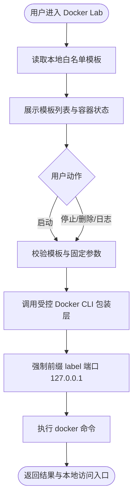

# 📋 Pikachu Docker Lab / 靶场编排中心设计文档

- 📊 报告类型：技术方案报告
- 👤 适用项目：Pikachu（PHP + MySQL 漏洞练习平台）
- 🕐 编写时间：2026-04-26
- 🏷️ 当前状态：设计完成，未修改源码
- 📎 设计边界：Windows / PowerShell、Docker Desktop for Windows、白名单模板、单机本地编排

## 1. 📊 方案摘要

本方案建议将 Docker Lab 作为 Pikachu 的一个新增独立模块接入，目录位于 `vul/dockerlab/`，继续沿用现有“模块独立页面 + header 菜单接入”的模式，不做全站重构。第一版采用“静态模板白名单 + PHP 受控调用 Docker CLI”的方式落地，只允许查看模板、启动、停止、删除、查看日志和打开本地访问入口。

核心原则如下：

- 只允许平台内置模板，不允许用户自定义 `image`、`command`、`volume`、`privileged`
- 所有容器名统一以 `pikachu-` 开头
- 所有容器统一加 `pikachu.lab=true` label
- 默认端口仅绑定 `127.0.0.1`
- 不挂载敏感宿主目录，不挂载 `/var/run/docker.sock`
- 第一版不新增数据库表，不自动 commit



## 2. 🔍 当前源码结构适配分析

### 2.1 现有结构

- 根目录负责公共入口与布局：`index.php`、`header.php`、`footer.php`、`install.php`
- 公共配置与函数位于 `inc/`
- 漏洞模块按目录位于 `vul/`
- 新模块通过 `header.php` 菜单索引接入
- 页面逻辑以单文件 PHP 为主，没有现成的 Service / Controller 分层

### 2.2 适配判断

当前代码结构适合新增一个独立模块，不适合第一版就引入复杂的后台服务编排平台。最稳妥的方式是：

- 新增 `vul/dockerlab/`
- 新增最少量辅助函数
- 继续使用现有页面骨架和样式
- 将 Docker 模板定义存放为本地文件

## 3. 🏗️ 推荐模块名称、目录与页面结构

### 3.1 模块名称

- 中文展示名：`Docker Lab`
- 目录名：`dockerlab`

### 3.2 推荐目录结构

```text
vul/
  dockerlab/
    dockerlab.php
    dockerlab_center.php
    dockerlab_logs.php
    templates/
      mysql-weak.json
      postgres-weak.json
      redis-unauth.json
      nginx-misconfig.json
      tomcat-weak.json
      flask-ssti.json
      flask-debug.json
      spring-actuator.json
      fastapi-docs.json
      node-proto-pollution.json
```

### 3.3 推荐页面结构

1. `dockerlab.php`
   - 模块概述
   - 使用前提
   - 安全限制
   - 进入编排中心入口
2. `dockerlab_center.php`
   - Docker 可用性状态
   - 模板列表
   - 运行状态
   - 操作按钮：启动 / 停止 / 删除 / 日志 / 打开
3. `dockerlab_logs.php`
   - 只读展示指定容器最近日志

## 4. ⚙️ 数据存储与操作方式

### 4.1 是否新增数据库表

第一版不建议新增数据库表。

理由：

- 模板定义是固定白名单，适合直接放文件
- 运行状态应以 `docker ps -a` 实时结果为准
- 可避免修改 `install.php` 和数据库初始化逻辑

### 4.2 Docker 操作方式对比

| 方案 | 优点 | 缺点 | 结论 |
|---|---|---|---|
| PHP 直接调用 Docker CLI | 接入快，贴合当前结构，无额外服务 | 权限边界更敏感，需要严格参数封死 | 推荐 MVP |
| 独立本地 Controller 服务 | 隔离更清晰，后续扩展更好 | 引入新进程与部署复杂度 | 后续阶段再考虑 |

### 4.3 推荐 MVP 方案

第一版使用 PHP 调用受控 Docker CLI，且只开放固定动作集合：

- 查看模板
- 启动容器
- 停止容器
- 删除容器
- 查看最近日志
- 打开本地访问链接

## 5. 🗂️ 模板格式与首批清单

### 5.1 推荐模板格式

第一版建议使用 JSON，不建议直接使用 `docker-compose.yml` 作为前端配置源。JSON 更容易在 PHP 中做字段白名单校验。

示例：

```json
{
  "id": "redis-unauth",
  "name": "Redis 未授权",
  "image": "redis:7-alpine",
  "container_name": "pikachu-redis-unauth",
  "labels": {
    "pikachu.lab": "true",
    "pikachu.template": "redis-unauth"
  },
  "ports": [
    {
      "host_ip": "127.0.0.1",
      "host_port": 16379,
      "container_port": 6379,
      "protocol": "tcp"
    }
  ],
  "env": [],
  "cmd": [],
  "entry_url": "",
  "notes": "演示 Redis 未授权访问。"
}
```

### 5.2 第一批模板清单

- `mysql-weak`
- `postgres-weak`
- `redis-unauth`
- `nginx-misconfig`
- `tomcat-weak`
- `flask-ssti`
- `flask-debug`
- `spring-actuator`
- `fastapi-docs`
- `node-proto-pollution`

MVP 建议先落地 6 个：

- `mysql-weak`
- `postgres-weak`
- `redis-unauth`
- `flask-ssti`
- `flask-debug`
- `fastapi-docs`

## 6. 🔐 安全限制与风险控制

### 6.1 强制限制

- 容器名必须以 `pikachu-` 开头
- 容器必须带 `pikachu.lab=true`
- 端口只能绑定 `127.0.0.1`
- 只允许白名单模板
- 不允许自定义 image、command、volume、privileged
- 不允许挂载宿主敏感目录
- 不允许挂载 `/var/run/docker.sock`
- 仅允许操作带目标 label 的容器

### 6.2 主要风险

- Docker CLI 参数注入
- 错误端口暴露到外网
- 容器挂载宿主目录导致越权
- 日志输出过大拖慢页面
- Web 进程拥有过高 Docker 控制权限

### 6.3 控制措施

- 所有 Docker 参数由服务端固定拼装
- 模板字段严格校验
- 日志默认只显示最近 200 行
- 启动 / 删除动作增加确认
- 所有查询统一加 label 过滤

## 7. 🧪 Windows PowerShell 验证命令

```powershell
docker version
docker info
docker ps -a --filter "label=pikachu.lab=true"
docker logs --tail 200 pikachu-redis-unauth
docker stop pikachu-redis-unauth
docker rm -f pikachu-redis-unauth
docker port pikachu-redis-unauth
netstat -ano | findstr 127.0.0.1:16379
```

服务验证示例：

```powershell
redis-cli -h 127.0.0.1 -p 16379 ping
mysql -h 127.0.0.1 -P 13306 -u root -p
psql -h 127.0.0.1 -p 15432 -U postgres
curl http://127.0.0.1:18080/
```

## 8. 📈 分阶段开发计划

### 8.1 Phase 1：MVP

- 新增 `vul/dockerlab/` 模块
- 增加概述页与编排中心页
- 接入模板白名单
- 实现启动 / 停止 / 删除 / 日志 / 打开链接

### 8.2 Phase 2：稳态增强

- 抽离 Docker Lab 公共辅助函数
- 增加更严格的模板字段校验
- 增加操作审计日志
- 增加更完整的状态提示

### 8.3 Phase 3：有限多容器模板

- 支持受控的固定多容器模板
- 仍不开放任意 compose 字段
- 仍不开放任意挂载和特权参数

### 8.4 Phase 4：独立 Controller 服务

仅在模板数量、审计需求和权限隔离需求明显增加后再考虑从 PHP 进程中抽离。

## 9. ✅ 结论与建议

Docker Lab 适合以 Pikachu 的新增独立模块形式落地，第一版不应引入复杂依赖，也不应修改现有漏洞模块。最合理的 MVP 是“本地 JSON 白名单模板 + PHP 受控 Docker CLI + 仅管理带 `pikachu.lab=true` 的本地容器”。该方案与当前仓库结构兼容，改动边界清晰，且能满足 Docker Desktop for Windows 的实际使用场景。

## 10. 📎 附录

### 10.1 本设计的关键约束

- 不修改现有漏洞模块
- 不做大规模重构
- 不自动 commit
- 不允许任意 Docker 命令执行
- 不允许用户自定义高风险运行参数

### 10.2 后续建议输出

若进入实现前细化阶段，下一份文档建议补充：

- 菜单索引分配方案
- 具体文件清单
- 模板 schema
- Docker 命令映射表
- 页面交互流程
