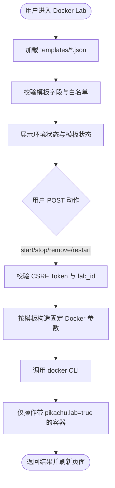

# 📋 Pikachu Docker Lab / 靶场编排中心实施级设计文档

- 📊 报告类型：技术方案报告
- 👤 适用项目：Pikachu（PHP + MySQL 漏洞练习平台）
- 🕐 编写时间：2026-04-26
- 🏷️ 当前状态：实施级设计完成，未修改源码
- 📎 设计边界：Windows / PowerShell、Docker Desktop for Windows、PHP 受控调用 Docker CLI、静态白名单模板、单机本地编排

## 1. 📊 方案摘要

本设计将 Docker Lab 落地为 Pikachu 的新增独立模块，目录位于 `vul/dockerlab/`。第一版不引入数据库表，不引入独立 Controller 服务，不开放任意 Docker 参数，只允许用户在页面中管理白名单模板对应的本地容器。

第一版 MVP 仅保留 3 个模板：

- `redis-unauth`
- `mysql-weak`
- `flask-ssti`

平台只允许以下动作：

- 查看模板
- 检查 Docker 环境
- 启动
- 停止
- 重启
- 删除
- 查看最近日志
- 打开本地访问入口



## 2. 🔍 当前源码结构适配分析

### 2.1 现有结构判断

Pikachu 当前是典型的“单体 PHP 页面 + 公共头尾 + 模块目录”结构：

- 根目录：`index.php`、`header.php`、`footer.php`、`install.php`
- 公共配置：`inc/config.inc.php`、`inc/mysql.inc.php`、`inc/function.php`
- 模块目录：`vul/<module>/`
- 菜单入口：集中在 `header.php`

### 2.2 对 Docker Lab 的直接影响

- 适合按 `vul/dockerlab/` 形式新增模块
- 适合新增少量本地库文件，不适合大规模分层重构
- 适合继续使用同步表单提交和结果回显
- 不适合第一版引入异步任务、消息队列、数据库状态表或独立编排服务

### 2.3 结论

最稳妥的落地方式是：

1. 新增 `vul/dockerlab/` 目录
2. 使用静态 JSON 模板作为白名单配置源
3. 使用 `dockerlab_lib.php` 封装受控命令
4. 所有状态变更动作走 `dockerlab_action.php` 的 POST 请求

## 3. 🏗️ MVP 范围与完整目录结构

### 3.1 MVP 范围收敛

第一版只支持 3 个实验环境：

- `redis-unauth`
- `mysql-weak`
- `flask-ssti`

以下模板推迟到第二批扩展：

- `postgres-weak`
- `nginx-misconfig`
- `tomcat-weak`
- `flask-debug`
- `spring-actuator`
- `fastapi-docs`
- `node-proto-pollution`

### 3.2 完整目录结构

```text
vul/dockerlab/
├── dockerlab.php
├── dockerlab_center.php
├── dockerlab_action.php
├── dockerlab_logs.php
├── dockerlab_check.php
├── dockerlab_lib.php
└── templates/
    ├── redis-unauth.json
    ├── mysql-weak.json
    └── flask-ssti.json
```

### 3.3 目录职责

| 路径 | 职责 |
|---|---|
| `dockerlab.php` | 模块概述、使用说明、安全边界 |
| `dockerlab_center.php` | 模板列表、状态展示、操作入口 |
| `dockerlab_action.php` | 仅处理 POST 状态变更动作 |
| `dockerlab_logs.php` | 查看指定模板对应容器最近日志 |
| `dockerlab_check.php` | 展示 Docker 环境检查详情 |
| `dockerlab_lib.php` | 模板、状态、命令、校验的公共函数 |
| `templates/*.json` | 白名单模板定义 |

## 4. 🛠️ dockerlab_lib.php 函数设计

### 4.1 函数清单

必须包含以下函数：

- `dockerlab_load_templates()`
- `dockerlab_get_template($id)`
- `dockerlab_validate_lab_id($id)`
- `dockerlab_validate_template($template)`
- `dockerlab_build_run_command($template)`
- `dockerlab_run_command($args, $timeout = 30)`
- `dockerlab_get_container_status($template)`
- `dockerlab_start_lab($id)`
- `dockerlab_stop_lab($id)`
- `dockerlab_remove_lab($id)`
- `dockerlab_get_logs($id, $tail = 200)`
- `dockerlab_check_environment()`

### 4.2 函数职责定义

#### 4.2.1 `dockerlab_load_templates()`

职责：

- 读取 `templates/*.json`
- 逐个 JSON 解析
- 调用 `dockerlab_validate_template()`
- 返回以 `id` 为键的模板数组

返回建议：

```php
array(
    'redis-unauth' => array(...),
    'mysql-weak' => array(...),
    'flask-ssti' => array(...)
)
```

#### 4.2.2 `dockerlab_get_template($id)`

职责：

- 先校验 `lab_id`
- 从 `dockerlab_load_templates()` 中返回对应模板
- 不存在则返回 `false`

#### 4.2.3 `dockerlab_validate_lab_id($id)`

职责：

- 校验 `lab_id` 是否匹配 `^[a-z0-9-]+$`
- 严格限制为小写字母、数字、连字符

返回：

- `true` / `false`

#### 4.2.4 `dockerlab_validate_template($template)`

职责：

- 校验模板字段完整性
- 校验字段类型和值域
- 拒绝不支持字段
- 拒绝危险配置

校验失败时：

- 返回 `array('ok' => false, 'error' => '...')`

成功时：

- 返回 `array('ok' => true)`

#### 4.2.5 `dockerlab_build_run_command($template)`

职责：

- 根据模板构造固定的 `docker run` 参数数组
- 不接收用户自定义覆盖
- 强制包含 label、container name、127.0.0.1 端口绑定

返回示例：

```php
array(
    'docker', 'run', '-d',
    '--name', 'pikachu-redis-unauth',
    '--label', 'pikachu.lab=true',
    '--label', 'pikachu.template=redis-unauth',
    '-p', '127.0.0.1:16379:6379',
    'redis:7-alpine'
)
```

#### 4.2.6 `dockerlab_run_command($args, $timeout = 30)`

职责：

- 用受控方式执行 Docker CLI
- 超时控制
- 捕获 stdout / stderr / exit code
- 统一返回结构化结果

返回建议：

```php
array(
    'ok' => true,
    'exit_code' => 0,
    'stdout' => '...',
    'stderr' => ''
)
```

#### 4.2.7 `dockerlab_get_container_status($template)`

职责：

- 基于模板中的 `container_name` 查询状态
- 只允许查询带 `pikachu.lab=true` label 的容器

建议状态枚举：

- `not_created`
- `running`
- `exited`
- `error`

#### 4.2.8 `dockerlab_start_lab($id)`

职责：

- 获取模板
- 检查现有容器状态
- 不存在则执行 `docker run`
- 已存在但停止则执行 `docker start`
- 统一返回结果

#### 4.2.9 `dockerlab_stop_lab($id)`

职责：

- 仅停止目标模板对应且带目标 label 的容器

#### 4.2.10 `dockerlab_remove_lab($id)`

职责：

- 仅删除目标模板对应且带目标 label 的容器
- 推荐内部使用 `docker rm -f`

#### 4.2.11 `dockerlab_get_logs($id, $tail = 200)`

职责：

- `tail` 上限固定为 `200`
- 只允许查询白名单模板对应容器
- 只允许读取目标 label 容器日志

#### 4.2.12 `dockerlab_check_environment()`

职责：

- 检查 `docker` 命令是否存在
- 检查 Docker Desktop / Engine 是否运行
- 检查当前用户是否可执行 Docker CLI

返回建议：

```php
array(
    'docker_found' => true,
    'docker_version_ok' => true,
    'daemon_reachable' => true,
    'message' => 'Docker Desktop is running'
)
```

## 5. 🔄 dockerlab_action.php POST 动作设计

### 5.1 允许动作

`dockerlab_action.php` 只允许以下动作：

- `start`
- `stop`
- `remove`
- `restart`

### 5.2 请求方式

所有状态改变操作必须是 `POST`：

- 禁止通过 `GET` 启动、停止、删除、重启容器

### 5.3 必须校验项

1. 校验请求方法必须为 `POST`
2. 校验 CSRF Token
3. 校验 `lab_id` 匹配 `^[a-z0-9-]+$`
4. 校验 `lab_id` 必须存在于 `templates`
5. 校验 `action` 必须在白名单中

### 5.4 明确拒绝的输入

以下字段即使用户提交，也必须忽略或拒绝：

- `image`
- `command`
- `cmd`
- `volume`
- `mount`
- `env`
- `port`
- `container_name`
- `network`
- `privileged`
- `cap_add`
- `device`

### 5.5 动作处理逻辑

| action | 内部调用 |
|---|---|
| `start` | `dockerlab_start_lab($id)` |
| `stop` | `dockerlab_stop_lab($id)` |
| `remove` | `dockerlab_remove_lab($id)` |
| `restart` | 先 `dockerlab_stop_lab($id)`，再 `dockerlab_start_lab($id)` |

## 6. 🗂️ JSON 模板 Schema 与校验规则

### 6.1 允许字段

- `id`
- `name`
- `category`
- `image`
- `container_name`
- `labels`
- `ports`
- `env`
- `cmd`
- `entry_url`
- `notes`
- `enabled`

### 6.2 字段定义

| 字段 | 类型 | 规则 |
|---|---|---|
| `id` | string | 必填，匹配 `^[a-z0-9-]+$` |
| `name` | string | 必填，显示名称 |
| `category` | string | 必填，建议如 `database`、`middleware`、`web` |
| `image` | string | 必填，只能来自模板，用户不可改 |
| `container_name` | string | 必填，必须以 `pikachu-` 开头 |
| `labels` | object | 必填，必须包含 `pikachu.lab=true` |
| `ports` | array | 必填，至少 1 项 |
| `env` | array | 可为空，格式为 `KEY=VALUE` |
| `cmd` | array | 可为空，仅来自模板 |
| `entry_url` | string | 可为空，用于 UI “打开” |
| `notes` | string | 可为空，用于教学说明 |
| `enabled` | bool | 必填，控制模板是否在 UI 展示 |

### 6.3 `ports` 子项规则

每一项必须包含：

- `host_ip`
- `host_port`
- `container_port`
- `protocol`

校验规则：

- `host_ip` 必须等于 `127.0.0.1`
- `host_port` 必须是 1-65535 的整数
- `container_port` 必须是 1-65535 的整数
- `protocol` 仅允许 `tcp`

### 6.4 明确不支持

第一版模板中明确不支持：

- `volumes`
- `mounts`
- `privileged`
- `network_mode`
- `--network host`
- `cap_add`
- `device`
- `pid`
- `ipc`
- `docker.sock`

## 7. 🛠️ Docker 命令映射表

### 7.1 命令映射

| 动作 | 命令 | 说明 |
|---|---|---|
| `check` | `docker version` | 检查 CLI 可用 |
| `check` | `docker info` | 检查 daemon 可达 |
| `status` | `docker ps -a --filter "label=pikachu.lab=true" --filter "name=<container_name>" --format "{{.Names}}|{{.Status}}"` | 查询容器状态 |
| `start`（首次） | `docker run -d --name <container_name> --label pikachu.lab=true ... -p 127.0.0.1:host:container <image>` | 首次创建并启动 |
| `start`（已存在） | `docker start <container_name>` | 启动已存在容器 |
| `stop` | `docker stop <container_name>` | 停止容器 |
| `remove` | `docker rm -f <container_name>` | 删除容器 |
| `logs` | `docker logs --tail 200 <container_name>` | 查看最近日志 |

### 7.2 `docker run` 必带参数

第一版 `docker run` 至少固定包含：

- `-d`
- `--name <container_name>`
- `--label pikachu.lab=true`
- `--label pikachu.template=<id>`
- `-p 127.0.0.1:<host_port>:<container_port>`

## 8. 🔐 Docker Lab 安全硬规则

### 8.1 强制规则

1. 禁止任意 Docker 命令执行
2. 禁止自定义 `image`
3. 禁止自定义 `command`
4. 禁止自定义 `volume`
5. 禁止 `privileged`
6. 禁止挂载 `/var/run/docker.sock`
7. 禁止 `--network host`
8. 禁止 `--cap-add`
9. 禁止 `--device`
10. 只操作带 `pikachu.lab=true` label 的容器
11. 日志输出必须经过 `htmlspecialchars`
12. 日志最多 200 行
13. 端口只绑定 `127.0.0.1`

### 8.2 设计含义

- 页面只能提交 `action` 和 `lab_id`
- 运行参数只来自静态模板
- 所有删除和状态检查都要同时满足“容器名匹配 + label 匹配”
- 即使存在同名异常输入，也不能覆盖模板配置

## 9. 🖥️ 页面设计细化

### 9.1 `dockerlab.php`

展示字段：

- 模块标题
- 模块用途
- MVP 支持的 3 个模板
- 使用前提：Docker Desktop 已启动
- 安全边界说明
- 进入 `dockerlab_center.php` 的入口链接

### 9.2 `dockerlab_check.php`

展示字段：

- `docker version` 检查结果
- `docker info` 检查结果
- Docker daemon 是否可达
- 当前错误消息
- 返回编排中心入口

### 9.3 `dockerlab_center.php`

展示字段：

- 环境状态摘要
- 模板名称
- 分类
- 镜像名
- 容器名
- 本地端口
- 当前状态
- 访问入口
- 操作按钮：启动 / 停止 / 重启 / 删除 / 日志
- 当前操作结果提示

### 9.4 `dockerlab_action.php`

职责字段：

- 接收 `POST`
- 接收 `action`
- 接收 `lab_id`
- 接收 `csrf_token`
- 返回执行结果后重定向或回显

该页不作为独立浏览页使用，只作为动作处理入口。

### 9.5 `dockerlab_logs.php`

展示字段：

- 模板名称
- 容器名
- 当前状态
- 最近日志文本
- 日志截断提示
- 返回编排中心入口

## 10. 🧪 验收标准

### 10.1 环境类验收

- Docker 未安装时，`dockerlab_check.php` 能明确提示不可用
- Docker 未运行时，`dockerlab_check.php` 能明确提示 daemon 不可达
- 模板目录正常时，3 个模板能被正确加载

### 10.2 模板操作类验收

- Redis：可启动 / 停止 / 删除
- MySQL：可启动 / 停止 / 删除
- Flask SSTI：可启动 / 停止 / 删除
- 运行中模板可查看日志
- 删除后状态回到 `not_created`

### 10.3 安全类验收

- 非白名单 `lab_id` 被拒绝
- 非 `pikachu.lab=true` 的容器不能被删除
- 用户无法通过请求参数覆盖 `image`
- 用户无法通过请求参数覆盖 `command`
- 用户无法通过请求参数覆盖 `port`
- 日志输出经过 HTML 转义
- 日志输出不超过 200 行

### 10.4 访问类验收

- 所有端口仅绑定 `127.0.0.1`
- UI 中“打开”链接能正确指向本地入口

## 11. 🧪 Windows PowerShell 验证命令

### 11.1 Docker 环境检查

```powershell
docker version
docker info
```

### 11.2 模板容器状态检查

```powershell
docker ps -a --filter "label=pikachu.lab=true"
docker ps -a --filter "label=pikachu.lab=true" --filter "name=pikachu-redis-unauth"
docker ps -a --filter "label=pikachu.lab=true" --filter "name=pikachu-mysql-weak"
docker ps -a --filter "label=pikachu.lab=true" --filter "name=pikachu-flask-ssti"
```

### 11.3 日志检查

```powershell
docker logs --tail 200 pikachu-redis-unauth
docker logs --tail 200 pikachu-mysql-weak
docker logs --tail 200 pikachu-flask-ssti
```

### 11.4 停止与删除检查

```powershell
docker stop pikachu-redis-unauth
docker rm -f pikachu-redis-unauth
docker stop pikachu-mysql-weak
docker rm -f pikachu-mysql-weak
docker stop pikachu-flask-ssti
docker rm -f pikachu-flask-ssti
```

### 11.5 本地端口绑定检查

```powershell
docker port pikachu-redis-unauth
docker port pikachu-mysql-weak
docker port pikachu-flask-ssti
netstat -ano | findstr 127.0.0.1
```

### 11.6 服务验证示例

```powershell
redis-cli -h 127.0.0.1 -p 16379 ping
mysql -h 127.0.0.1 -P 13306 -u root -p
curl http://127.0.0.1:15000/
```

## 12. 📈 分阶段开发计划

### 12.1 Phase 1：MVP

- 新增 `vul/dockerlab/` 全部页面骨架
- 新增 3 个 JSON 模板
- 完成模板加载、环境检查、状态展示
- 完成 `start / stop / remove / restart / logs`

### 12.2 Phase 2：第二批模板扩展

- 增加 `postgres-weak`
- 增加 `nginx-misconfig`
- 增加 `flask-debug`
- 增加 `fastapi-docs`

### 12.3 Phase 3：稳定性增强

- 强化错误提示与边界处理
- 优化日志页展示
- 增加更完整的模板校验错误反馈

## 13. ✅ 结论与建议

这份实施级设计将 Docker Lab 第一版严格限制在“3 个白名单模板 + 受控 Docker CLI + 本地单机容器管理”的范围内，已经可以直接指导后续开发。该方案与当前 Pikachu 仓库结构兼容，不要求改数据库，不要求引入独立服务，且把高风险的 Docker 能力压缩在固定动作和固定参数之内。

## 14. 📎 附录

### 14.1 当前 MVP 模板清单

- `redis-unauth`
- `mysql-weak`
- `flask-ssti`

### 14.2 第二批扩展模板清单

- `postgres-weak`
- `nginx-misconfig`
- `tomcat-weak`
- `flask-debug`
- `spring-actuator`
- `fastapi-docs`
- `node-proto-pollution`

### 14.3 下一步建议输出

进入开发前，建议再补一份更细的开发任务单，至少包含：

- 菜单索引分配方案
- 每个页面的伪代码流程
- 3 个模板的完整 JSON 实例
- Docker CLI 输出解析格式
