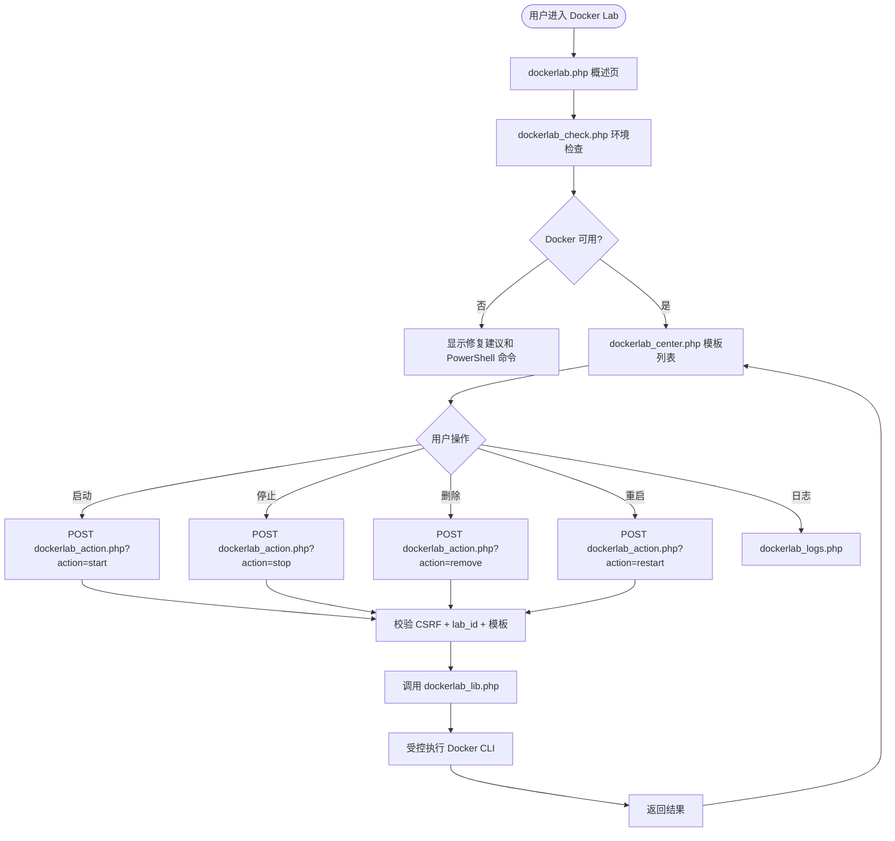
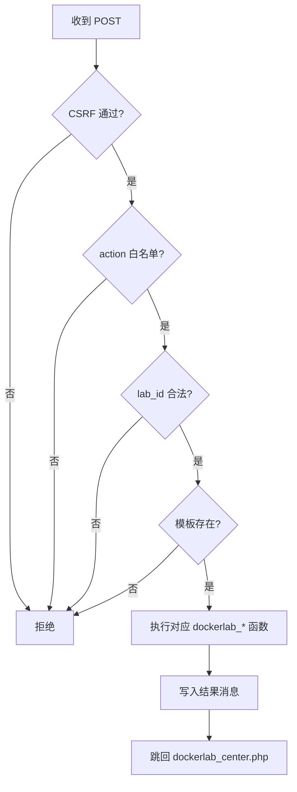

# Pikachu Docker Lab / 靶场编排中心实施级施工流程

> 适用项目：Pikachu（PHP + MySQL 漏洞练习平台）  
> 目标模块：`vul/dockerlab/`  
> 适用环境：Windows / Docker Desktop / PowerShell / PHP + MySQL  
> 文档用途：交给 Codex 作为开发前施工流程、边界约束、验收清单  
> 当前定位：**新增独立模块，不改现有漏洞模块，不做全站重构**

---

## 0. 总体结论

本次建议在 Pikachu 中新增一个独立模块：

```text
Docker Lab / 靶场编排中心
```

该模块用于通过 Web 页面管理本地 Docker 漏洞环境，第一版只做受控 MVP：

```text
1. Docker 环境检查
2. 白名单模板列表
3. 启动容器
4. 停止容器
5. 删除容器
6. 查看日志
7. 打开本地靶场入口
```

第一版只落地 3 个模板：

```text
redis-unauth    Redis 未授权访问
mysql-weak      MySQL 弱口令
flask-ssti      Flask SSTI
```

第一版不做：

```text
任意镜像拉取
任意命令执行
任意 volume 挂载
privileged 容器
Docker Compose 多容器编排
独立 Controller 服务
数据库表改造
自动 commit
```

---

## 1. 核心设计原则

### 1.1 功能边界

Docker Lab 是 Pikachu 的扩展模块，不替代现有 PHP 漏洞模块。

它只负责管理本机受控 Docker 靶场：

```text
Pikachu Web 页面
    ↓
白名单模板
    ↓
受控 Docker CLI 包装层
    ↓
本机 Docker Desktop
    ↓
本地 127.0.0.1 端口靶场
```

### 1.2 安全边界

必须坚持以下硬规则：

```text
1. 只允许内置白名单模板
2. 不允许用户自定义 image
3. 不允许用户自定义 command
4. 不允许用户自定义 volume
5. 不允许 privileged
6. 不允许 --network host
7. 不允许 --pid host
8. 不允许 --cap-add
9. 不允许 --device
10. 不允许挂载 /var/run/docker.sock
11. 端口默认只绑定 127.0.0.1
12. 容器名必须以 pikachu- 开头
13. 容器必须带 pikachu.lab=true label
14. 只允许操作带 pikachu.lab=true 的容器
15. 所有状态改变动作必须 POST
16. 启动、停止、删除、重启必须校验 CSRF Token
17. Docker 命令必须由服务端根据模板固定拼装
18. 所有输出到页面的日志、命令结果、容器名必须 htmlspecialchars
19. 日志最多显示 200 行
20. 不允许页面参数覆盖模板里的 image / cmd / env / port
```

---

## 2. 推荐最终目录结构

新增目录：

```text
vul/dockerlab/
├── dockerlab.php
├── dockerlab_check.php
├── dockerlab_center.php
├── dockerlab_action.php
├── dockerlab_logs.php
├── dockerlab_lib.php
└── templates/
    ├── redis-unauth.json
    ├── mysql-weak.json
    └── flask-ssti.json
```

### 2.1 文件职责

| 文件 | 职责 |
|---|---|
| `dockerlab.php` | 模块概述页，说明功能、安全边界、入口 |
| `dockerlab_check.php` | Docker 环境检查页 |
| `dockerlab_center.php` | 编排中心，展示模板、状态、操作按钮 |
| `dockerlab_action.php` | POST 操作入口：start / stop / remove / restart |
| `dockerlab_logs.php` | 查看指定靶场容器最近日志 |
| `dockerlab_lib.php` | Docker Lab 公共函数和安全包装层 |
| `templates/*.json` | 白名单模板定义 |

---

## 3. 页面流程设计

### 3.1 用户访问流程



### 3.2 Docker 命令调用流程

```mermaid
flowchart LR
    A[用户提交 lab_id + action] --> B[校验 CSRF]
    B --> C[校验 action 白名单]
    C --> D[校验 lab_id 格式]
    D --> E[读取 templates/lab_id.json]
    E --> F[校验模板 Schema]
    F --> G[拼装固定 Docker 参数]
    G --> H[逐项 escapeshellarg]
    H --> I[执行 Docker 命令]
    I --> J[解析结果并输出]
```



---

## 4. 菜单接入设计

需要在 `header.php` 中新增 Docker Lab 菜单项。

建议菜单：

```text
Docker Lab
├── 模块概述
├── 环境检查
├── 编排中心
```

如果当前菜单索引已经到 139，可以从 140 开始，例如：

```text
$ACTIVE[140] 父菜单 Docker Lab
$ACTIVE[141] dockerlab.php
$ACTIVE[142] dockerlab_check.php
$ACTIVE[143] dockerlab_center.php
```

必须使用 `isset()` 防护：

```php
<?php echo isset($ACTIVE[140]) ? $ACTIVE[140] : '';?>
```

新增页面统一使用：

```php
$ACTIVE = array_fill(0, 160, '');
$ACTIVE[140] = 'active open';
$ACTIVE[141] = 'active';
```

不要使用旧式错误写法：

```php
if ($SELF_PAGE = "dockerlab.php")
```

---

## 5. dockerlab_lib.php 函数设计

新增文件：

```text
vul/dockerlab/dockerlab_lib.php
```

### 5.1 必须包含的函数

```php
dockerlab_template_dir()
dockerlab_load_templates()
dockerlab_get_template($id)
dockerlab_validate_lab_id($id)
dockerlab_validate_template($template)
dockerlab_escape_args($args)
dockerlab_run_command($args, $timeout = 30)
dockerlab_docker_available()
dockerlab_check_environment()
dockerlab_build_run_args($template)
dockerlab_get_container_status($template)
dockerlab_start_lab($id)
dockerlab_stop_lab($id)
dockerlab_remove_lab($id)
dockerlab_restart_lab($id)
dockerlab_get_logs($id, $tail = 200)
dockerlab_get_csrf_token()
dockerlab_check_csrf_token($token)
dockerlab_html($value)
```

### 5.2 lab_id 校验

只允许：

```regex
^[a-z0-9-]+$
```

错误示例必须拒绝：

```text
../../xxx
redis;whoami
redis && calc
redis|cmd
redis$(whoami)
redis`whoami`
```

### 5.3 模板校验规则

模板必须满足：

```text
id 必须匹配 ^[a-z0-9-]+$
container_name 必须以 pikachu- 开头
labels.pikachu.lab 必须等于 true
ports 只能绑定 127.0.0.1
host_port 必须是 1024-65535
container_port 必须是 1-65535
image 必须非空且来自模板
cmd 只能来自模板
env 只能来自模板
不允许 volumes 字段
不允许 privileged 字段
不允许 network_mode 字段
不允许 cap_add 字段
不允许 devices 字段
```

### 5.4 Docker 命令执行包装

禁止页面直接 `exec()`。

必须统一走：

```php
dockerlab_run_command($args, $timeout = 30)
```

参数是数组，例如：

```php
$args = array(
    'docker',
    'ps',
    '-a',
    '--filter',
    'label=pikachu.lab=true',
    '--format',
    '{{.Names}}\t{{.Status}}\t{{.Ports}}'
);
```

执行前逐项转义：

```php
$cmd = implode(' ', array_map('escapeshellarg', $args));
```

注意：`escapeshellarg('docker')` 生成 `'docker'` 在 Windows 下通常仍可执行，但如果兼容性有问题，可只对参数转义，命令本体固定为 `docker`，禁止用户控制命令本体。

### 5.5 超时设计

MVP 可以使用简单方案：

```text
默认 timeout = 30 秒
docker logs timeout = 10 秒
docker pull 不在第一版页面内执行
```

如果镜像不存在，启动时提示用户手工执行：

```powershell
docker pull redis:7-alpine
```

---

## 6. JSON 模板 Schema

### 6.1 标准模板字段

```json
{
  "id": "redis-unauth",
  "name": "Redis 未授权访问",
  "category": "database",
  "level": "low",
  "image": "redis:7-alpine",
  "container_name": "pikachu-redis-unauth",
  "labels": {
    "pikachu.lab": "true",
    "pikachu.template": "redis-unauth"
  },
  "ports": [
    {
      "host_ip": "127.0.0.1",
      "host_port": 16379,
      "container_port": 6379,
      "protocol": "tcp"
    }
  ],
  "env": [],
  "cmd": [
    "redis-server",
    "--protected-mode",
    "no"
  ],
  "entry_url": "",
  "notes": "演示 Redis 未授权访问。"
}
```

### 6.2 MVP 三个模板

#### redis-unauth.json

```json
{
  "id": "redis-unauth",
  "name": "Redis 未授权访问",
  "category": "database",
  "level": "low",
  "image": "redis:7-alpine",
  "container_name": "pikachu-redis-unauth",
  "labels": {
    "pikachu.lab": "true",
    "pikachu.template": "redis-unauth"
  },
  "ports": [
    {
      "host_ip": "127.0.0.1",
      "host_port": 16379,
      "container_port": 6379,
      "protocol": "tcp"
    }
  ],
  "env": [],
  "cmd": [
    "redis-server",
    "--protected-mode",
    "no"
  ],
  "entry_url": "",
  "notes": "演示 Redis 未授权访问。仅绑定本地 127.0.0.1。"
}
```

#### mysql-weak.json

```json
{
  "id": "mysql-weak",
  "name": "MySQL 弱口令",
  "category": "database",
  "level": "low",
  "image": "mysql:8.0",
  "container_name": "pikachu-mysql-weak",
  "labels": {
    "pikachu.lab": "true",
    "pikachu.template": "mysql-weak"
  },
  "ports": [
    {
      "host_ip": "127.0.0.1",
      "host_port": 13306,
      "container_port": 3306,
      "protocol": "tcp"
    }
  ],
  "env": [
    {
      "name": "MYSQL_ROOT_PASSWORD",
      "value": "root123456"
    },
    {
      "name": "MYSQL_DATABASE",
      "value": "pikachu_lab"
    }
  ],
  "cmd": [],
  "entry_url": "",
  "notes": "演示数据库弱口令风险。账号 root，密码 root123456。"
}
```

#### flask-ssti.json

```json
{
  "id": "flask-ssti",
  "name": "Flask SSTI",
  "category": "web-framework",
  "level": "medium",
  "image": "ghcr.io/pikachu-lab/flask-ssti:latest",
  "container_name": "pikachu-flask-ssti",
  "labels": {
    "pikachu.lab": "true",
    "pikachu.template": "flask-ssti"
  },
  "ports": [
    {
      "host_ip": "127.0.0.1",
      "host_port": 15000,
      "container_port": 5000,
      "protocol": "tcp"
    }
  ],
  "env": [],
  "cmd": [],
  "entry_url": "http://127.0.0.1:15000/",
  "notes": "演示 Flask/Jinja2 模板注入。镜像可后续替换为项目自建镜像。"
}
```

> 注意：`flask-ssti` 如果没有现成镜像，第一版可以先把模板设为 disabled，或让 Codex 同步创建一个最小 Flask SSTI Dockerfile。  
> 但 MVP 阶段建议先不要引入构建流程，优先使用已有镜像或后续单独补。

---

## 7. Docker 命令映射表

| 动作 | 命令模式 |
|---|---|
| 环境检查 | `docker version` |
| 运行状态 | `docker ps -a --filter label=pikachu.lab=true --format ...` |
| 启动 | `docker run -d --name <container> --label pikachu.lab=true --label pikachu.template=<id> -p 127.0.0.1:<host>:<container>/<protocol> <env> <image> <cmd>` |
| 停止 | `docker stop <container>` |
| 删除 | `docker rm -f <container>` |
| 重启 | stop + remove + start |
| 日志 | `docker logs --tail 200 <container>` |
| 端口 | `docker port <container>` |

必须注意：

```text
remove 前必须确认容器名来自模板
remove 前必须确认容器带 pikachu.lab=true label
不允许删除任意用户传入的容器名
```

---

## 8. 页面详细设计

### 8.1 dockerlab.php

功能：

```text
模块概述
安全声明
MVP 支持模板
进入环境检查
进入编排中心
```

显示内容：

```text
Docker Lab 是本地 Docker 靶场编排中心
仅允许白名单模板
仅建议本地使用
默认绑定 127.0.0.1
```

### 8.2 dockerlab_check.php

检查项：

```text
PHP_OS
exec 是否可用
shell_exec 是否可用
docker version
docker info
docker ps 是否可执行
Docker 是否运行
```

页面输出：

```text
检查项 | 状态 | 说明 | 修复建议
```

Windows PowerShell 修复建议：

```powershell
docker version
docker info
```

### 8.3 dockerlab_center.php

展示字段：

```text
模板名称
分类
风险等级
镜像
容器名
本地端口
状态
入口
操作
```

操作按钮：

```text
启动
停止
删除
重启
日志
打开
```

状态改变按钮必须是 POST 表单，带 CSRF Token。

### 8.4 dockerlab_action.php

只处理 POST：

```text
action=start|stop|remove|restart
lab_id=redis-unauth
csrf_token=...
```

处理流程：



### 8.5 dockerlab_logs.php

输入：

```text
lab_id
```

要求：

```text
只允许查看模板内定义的容器
只显示 docker logs --tail 200
日志必须 htmlspecialchars
```

---

## 9. CSRF 设计

可以复用 PHP Session：

```php
function dockerlab_get_csrf_token(){
    if(empty($_SESSION['dockerlab_csrf'])){
        $_SESSION['dockerlab_csrf'] = bin2hex(random_bytes(16));
    }
    return $_SESSION['dockerlab_csrf'];
}

function dockerlab_check_csrf_token($token){
    return isset($_SESSION['dockerlab_csrf']) && hash_equals($_SESSION['dockerlab_csrf'], $token);
}
```

所有 POST 操作必须包含：

```html
<input type="hidden" name="csrf_token" value="<?php echo htmlspecialchars($csrf_token); ?>">
```

---

## 10. Docker Lab 安全硬规则

实现时必须逐项确认：

```text
1. 禁止任意 Docker 命令执行
2. 禁止自定义 image
3. 禁止自定义 command
4. 禁止自定义 env
5. 禁止自定义 volume
6. 禁止 privileged
7. 禁止 --network host
8. 禁止 --pid host
9. 禁止 --cap-add
10. 禁止 --device
11. 禁止挂载 /var/run/docker.sock
12. 禁止删除非 pikachu.lab=true 容器
13. 禁止操作非 pikachu- 前缀容器
14. 默认端口只绑定 127.0.0.1
15. 日志最多 200 行
16. 所有日志输出 htmlspecialchars
17. 所有状态改变动作必须 POST
18. 所有 POST 必须 CSRF
19. 所有 lab_id 必须正则校验
20. 所有模板字段必须校验
```

---

## 11. 验收标准

### 11.1 环境检查

| 场景 | 预期 |
|---|---|
| Docker 未安装 | 页面提示未找到 docker |
| Docker 未运行 | 页面提示 Docker 不可用 |
| exec 被禁用 | 页面提示 PHP 禁用了命令执行 |
| Docker 正常 | 页面显示 Docker version/info 成功 |

### 11.2 模板加载

| 场景 | 预期 |
|---|---|
| templates 目录存在 | 正常加载 3 个模板 |
| JSON 格式错误 | 页面提示模板错误 |
| container_name 不以 pikachu- 开头 | 模板被拒绝 |
| host_ip 不是 127.0.0.1 | 模板被拒绝 |
| 存在 volumes 字段 | 模板被拒绝 |

### 11.3 操作安全

| 场景 | 预期 |
|---|---|
| GET 请求 start | 拒绝 |
| POST 缺 CSRF | 拒绝 |
| lab_id=../../xxx | 拒绝 |
| lab_id=redis;whoami | 拒绝 |
| 删除非 pikachu 容器 | 拒绝 |
| 用户传 image 参数 | 忽略或拒绝 |

### 11.4 靶场运行

| 模板 | 验证命令 |
|---|---|
| Redis | `redis-cli -h 127.0.0.1 -p 16379 ping` |
| MySQL | `mysql -h 127.0.0.1 -P 13306 -u root -p` |
| Flask SSTI | `curl http://127.0.0.1:15000/` |

---

## 12. Windows PowerShell 验证命令

### 12.1 Docker 环境

```powershell
docker version
docker info
docker ps -a --filter "label=pikachu.lab=true"
```

### 12.2 Redis

```powershell
docker pull redis:7-alpine
docker run -d --name pikachu-redis-unauth --label pikachu.lab=true --label pikachu.template=redis-unauth -p 127.0.0.1:16379:6379 redis:7-alpine redis-server --protected-mode no
docker logs --tail 200 pikachu-redis-unauth
docker stop pikachu-redis-unauth
docker rm -f pikachu-redis-unauth
```

### 12.3 MySQL

```powershell
docker pull mysql:8.0
docker run -d --name pikachu-mysql-weak --label pikachu.lab=true --label pikachu.template=mysql-weak -p 127.0.0.1:13306:3306 -e MYSQL_ROOT_PASSWORD=root123456 -e MYSQL_DATABASE=pikachu_lab mysql:8.0
docker logs --tail 200 pikachu-mysql-weak
docker stop pikachu-mysql-weak
docker rm -f pikachu-mysql-weak
```

### 12.4 清理全部 Pikachu Lab 容器

```powershell
docker ps -a --filter "label=pikachu.lab=true" --format "{{.Names}}" | ForEach-Object {
    docker rm -f $_
}
```

---

## 13. 推荐开发阶段

### Phase 1：骨架和只读能力

```text
新增 dockerlab.php
新增 dockerlab_check.php
新增 dockerlab_center.php
新增 dockerlab_lib.php
新增 templates/*.json
只做模板加载和环境检查
不执行 start/stop/remove
```

### Phase 2：受控操作

```text
新增 dockerlab_action.php
实现 POST + CSRF
实现 start / stop / remove / restart
实现 dockerlab_logs.php
```

### Phase 3：页面体验

```text
状态展示优化
日志展示优化
错误提示优化
入口链接优化
```

### Phase 4：模板扩展

```text
增加 tomcat-weak
增加 nginx-misconfig
增加 postgres-weak
增加 flask-debug
```

---

## 14. 回滚方案

如果 Docker Lab 开发失败，回滚范围必须清晰：

```text
删除 vul/dockerlab/
回退 header.php 菜单变更
回退 README.md Docker Lab 说明
不影响已有 JWT / Host Header / Session Fixation / CORS / Clickjacking
```

PowerShell 回滚示例：

```powershell
git restore .\header.php .\README.md
Remove-Item -Recurse -Force .\vul\dockerlab
git status --short
```

---

## 15. Codex 开发提示词

下面提示词可直接交给 Codex 开始开发第一阶段。

```text
项目：Pikachu（PHP + MySQL 漏洞练习平台）

任务：
根据《Pikachu Docker Lab / 靶场编排中心实施级施工流程》新增 Docker Lab MVP 第一阶段。

本轮只做 Phase 1：骨架和只读能力，不执行真正的 start/stop/remove。

允许新增：
- vul/dockerlab/dockerlab.php
- vul/dockerlab/dockerlab_check.php
- vul/dockerlab/dockerlab_center.php
- vul/dockerlab/dockerlab_lib.php
- vul/dockerlab/templates/redis-unauth.json
- vul/dockerlab/templates/mysql-weak.json
- vul/dockerlab/templates/flask-ssti.json

允许修改：
- header.php
- README.md

禁止修改：
- 现有漏洞模块
- install.php
- 数据库结构
- inc/function.php，除非绝对必要
- Docker Lab 以外的 vul 目录

固定要求：
- 默认中文输出
- Windows / PowerShell 环境
- 不要自动 commit
- 不要引入 composer / npm
- 不要大规模重构
- Docker Lab 第一版只允许白名单模板
- 不允许用户自定义 image / command / volume / privileged
- 默认端口只绑定 127.0.0.1
- 所有页面保持 Pikachu 原有 header/footer 风格
- 菜单接入必须使用 isset($ACTIVE[index]) 防护
- 新页面不要使用 if ($SELF_PAGE = "xxx.php") 赋值写法

Phase 1 实现内容：
1. 新增 dockerlab.php
   - 模块概述
   - 安全边界
   - MVP 支持模板
   - 跳转到环境检查和编排中心

2. 新增 dockerlab_check.php
   - 检查 PHP_OS
   - 检查 exec / shell_exec 是否禁用
   - 尝试执行 docker version
   - 尝试执行 docker info
   - 输出检查结果和 PowerShell 修复建议
   - 如果 docker 不存在，不要报 PHP fatal error

3. 新增 dockerlab_center.php
   - 读取 templates/*.json
   - 校验模板字段
   - 展示模板列表
   - 展示模板名称、分类、镜像、容器名、端口、入口、说明
   - 暂时只显示“启动/停止/删除/日志”按钮为 disabled 或提示 Phase 2 开启
   - 不执行任何 Docker 修改动作

4. 新增 dockerlab_lib.php
   至少包含：
   - dockerlab_template_dir()
   - dockerlab_load_templates()
   - dockerlab_get_template($id)
   - dockerlab_validate_lab_id($id)
   - dockerlab_validate_template($template)
   - dockerlab_html($value)
   - dockerlab_run_command($args, $timeout = 30)
   - dockerlab_check_environment()

5. 新增三个 JSON 模板：
   - redis-unauth.json
   - mysql-weak.json
   - flask-ssti.json

6. 修改 header.php
   - 新增 Docker Lab 菜单
   - 子菜单：模块概述、环境检查、编排中心
   - 使用 isset 防护
   - 不影响已有菜单

7. 修改 README.md
   - 增加 Docker Lab 规划 / MVP 说明
   - 明确当前 Phase 1 只做只读模板和环境检查
   - 不要写成完整编排能力已完成

安全要求：
- 不允许任意 Docker 命令执行
- 不允许用户传入 image / command / volume
- 模板字段必须校验
- 容器名必须 pikachu- 开头
- 端口必须绑定 127.0.0.1
- 不允许 privileged / volumes / network_mode / cap_add / devices

验收要求：
1. vul/dockerlab/ 目录存在
2. 三个页面可打开
3. 模板列表可显示三条模板
4. Docker 不存在时页面友好提示
5. header.php 菜单可进入 Docker Lab
6. README.md 已说明 Docker Lab Phase 1 状态
7. PHP 语法检查通过
8. git status 输出变更摘要

最终输出：
- 变更文件清单
- 每个文件改了什么
- Docker Lab 菜单索引
- 模板加载验收结果
- Docker 环境检查结果
- PHP 语法检查结果
- git status 摘要
```

---

## 16. 最终建议

本模块不要一次性完成全部能力。建议严格按阶段：

```text
第一轮：只读骨架
第二轮：POST + CSRF + start/stop/remove
第三轮：日志和状态优化
第四轮：新增更多模板
```

这样可以避免把 Pikachu 改成一个高风险 Docker Web 控制台。
